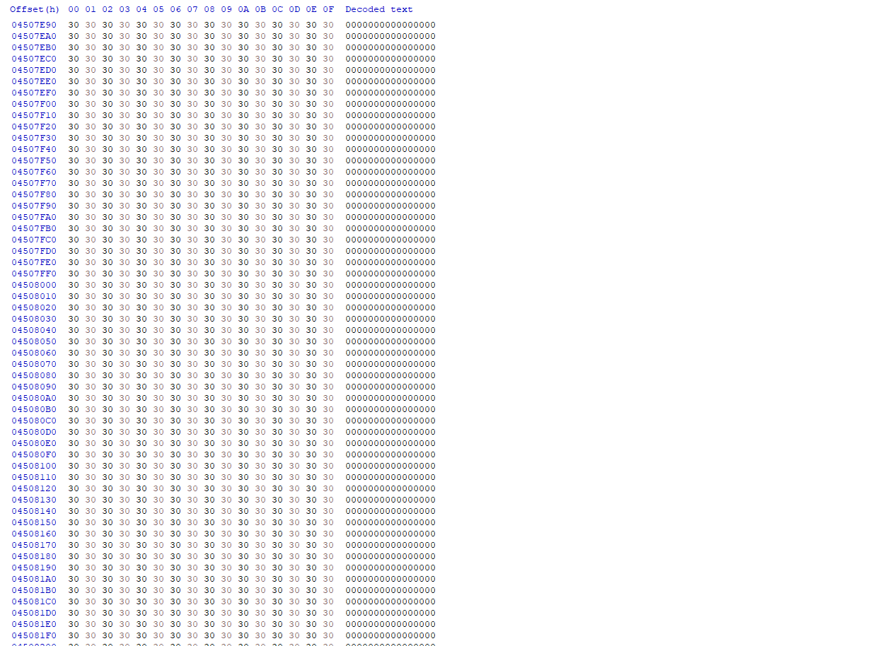

# File-Unpumper
Simple File unpumper for pepole who reversing Malwares 

# What is Pumping 

Pumping usually used by malwares authors to  make it hard to detect their malware well they usually add fake bytes when you decode it will be null so they can keep original file size

# Example of Pumped File

